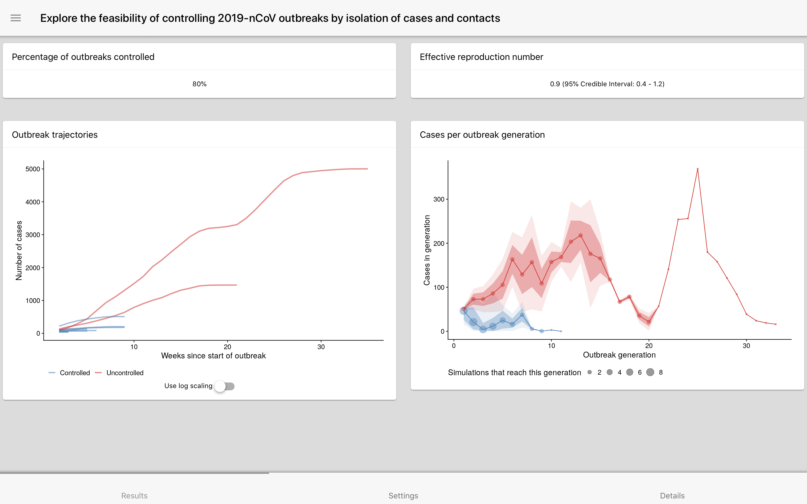
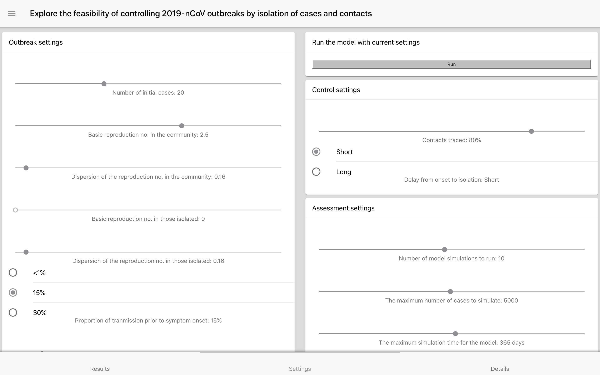
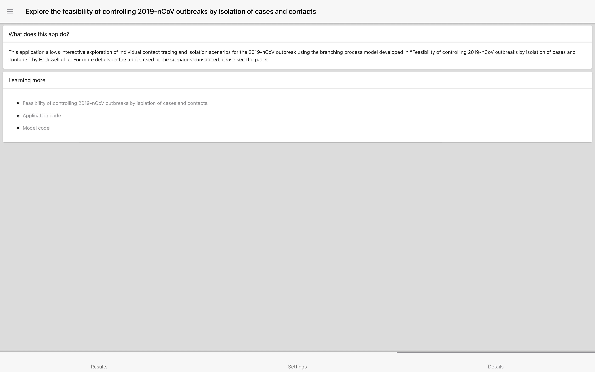

<!-- README.md is generated from README.Rmd. Please edit that file -->

```{r, include = FALSE}
knitr::opts_chunk$set(
  collapse = TRUE,
  comment = "#>",
  fig.path = "man/figures/README-",
  out.width = "100%"
)
```

# Explore: Feasibility of controlling 2019-nCoV outbreaks by isolation of cases and contacts

<!-- badges: start -->
[](https://www.tidyverse.org/lifecycle/#experimental)
<!-- badges: end -->

Explore individual scenarios using the model developed in "Feasibility of controlling 2019-nCoV outbreaks by isolation of cases and contacts".

This applications is mobile ready and uses asynchronous programming so that a large number of users can be supported. 

## Running the app

Install the application and required dependencies with the following:

```{r, eval = FALSE}
remotes::install_github("epiforecasts/exploreringbp", dependencies = TRUE)
```

For use cases in which high loads are expected the app can be run in parallel using the `future` package. *This step is optional.*

```{r, eval = FALSE}
## For high load settings with multiple cores available
future::plan("multisession")
```

Run the app locally.

```{r, eval = FALSE}
exploreringbp::run_app()
```

## Usage

The results tab contains a summary of a single outbreak scenario.

```{r,width = "65%", echo = FALSE} 

```

The settings tab contains sliders which can be used to vary the outbreak scenario.

```{r,width = "65%", echo = FALSE} 

```


The details tab contains a brief overview of the model used in the app and links to resources for further information.

```{r,width = "65%", echo = FALSE} 

```

## Things to do

- [ ] Determine if the app is useful and what direction to take it in
- [ ] Add all model parameters to settings (with grouped settings for SARS-like)
- [ ] Write up model summary
- [ ] Write up links to other work
- [ ] Finalise about section
- [ ] Think if there is any other useful output

## Docker


This app was developed in a docker container based on the tidyverse docker image. 

To build the docker image run (from the `exploreringbp` directory):

```{bash, eval = FALSE}
docker build . -t exploreringbp
```

To run the docker image run:

```{bash, eval = FALSE}
docker run -d -p 8787:8787 --name exploreringbp -e USER=exploreringbp -e PASSWORD=exploreringbp exploreringbp
```

The rstudio client can be found on port :8787 at your local machines ip. The default username:password is exploreringbp:exploreringbp, set the user with -e USER=username, and the password with - e PASSWORD=newpasswordhere.
